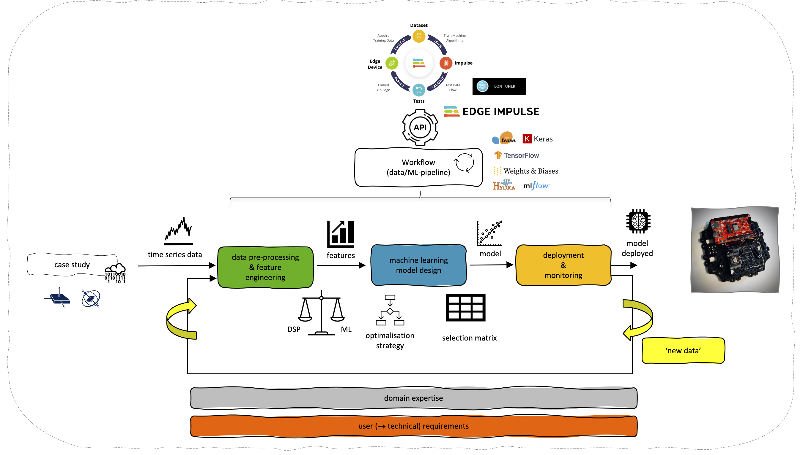

# Machine Learning @ the Extreme Edge

One of the challenges today is real-time and energy-efficient information extraction and processing at the edge by using Artificial Intelligence. However, there is a recent trend to implement <b>machine learning on end-point devices</b>. These end-point devices are located on the <b>extreme edge</b>, the border between the analog (physical world) and the digital world. It consists of one or more sensors and a resource-constrained embedded device, a device with a limited amount of memory, computing power and power consumption. <b>Today's challenge is to develop accurate, energy-efficient machine learning models that can be deployed on these end-point devices</b>.

 

 

 <b>Machine Learning at the Extreme Edge (ML@E2dge) looks at how a developer can apply machine learning in the development of accurate, energy-efficient, and intelligent (wireless) (battery-powered) end-point devices and systems</b>. Starting from a case study, a machine learning model is developed, optimized and deployed. In the project, we limit ourselves to a supervised machine learning regression problem. The selected end-point device is a Cortex®-M4 ARM® microcontroller (nRF52840, Nordic Semiconductor), in combination with an Inertial Measurement Unit (IMU) sensor (MTi-3, Xsens). In the project open-source software frameworks such as scikit-learn, TensorFlow and Keras are used, in combination with Edge Impulse Studio. For the experiment, metrics and version tracking, MLOps (Machine Learning Operations) frameworks such as ml<i>flow</i> and Weights and Biases are explored.

 

 The outcome of the project is a guideline, a workflow, (software) tools, that developers can use and apply in the design of the next generation of embedded intelligent end-point devices and systems.

 
